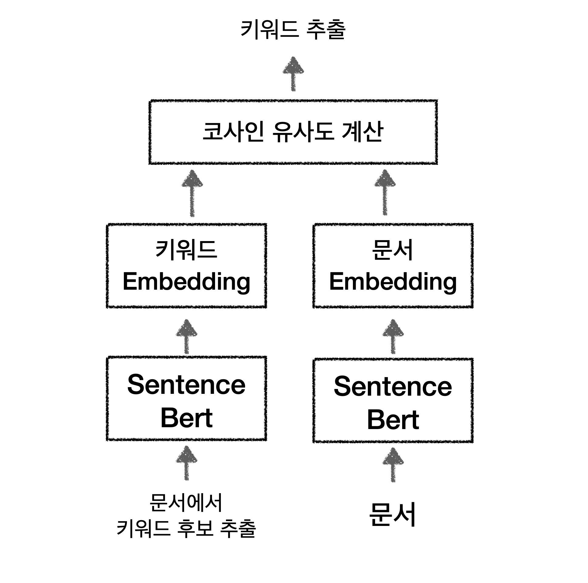

# Sentence bert를 활용해 문서 키워드 추출하기

- Sentence bert와 Siames network(샴 네트워크)를 활용해 문서의 핵심 키워드를 추출하는 모델을 구현하였음.

- 문서 키워드는 문서에서 확보한 키워드 후보와 문서 간 코사인유사도 계산을 통해 얻을 수 있음.

- 키워드 추출 구조는 Sentence Bert를 활용한 Bi Encoder 구조와 같음.

 

## 키워드 추출 예시

> **도서정보 : 그림과 실습으로 배우는 도커 & 쿠버네티스**

<table border="1" class="dataframe"> <thead><tr style="text-align: right;"><th></th><th>유사도</th></tr> </thead> <tbody><tr><th>메타데이터</th><td>0.942622</td></tr><tr><th>virtualbox</th><td>0.922685</td></tr><tr><th>쿠버네티스</th><td>0.919135</td></tr><tr><th>리눅스</th><td>0.901917</td></tr><tr><th>mysql</th><td>0.900849</td></tr><tr><th>프롬프트</th><td>0.898217</td></tr><tr><th>레드마</th><td>0.895093</td></tr><tr><th>리눅스용</th><td>0.894459</td></tr><tr><th>디플로이먼트</th><td>0.893091</td></tr><tr><th>macos</th><td>0.890312</td></tr><tr><th>도커</th><td>0.889823</td></tr><tr><th>컴포즈</th><td>0.888451</td></tr><tr><th>준비</th><td>0.882835</td></tr><tr><th>실습</th><td>0.881106</td></tr><tr><th>삭제</th><td>0.879038</td></tr> </tbody></table>

---

 

> **도서정보 : 파이썬 딥러닝 파이토치(Python Deep Learning PyTorch)**

<table border="1" class="dataframe"> <thead> <tr style="text-align: right;"> <th></th> <th>유사도</th> </tr> </thead> <tbody> <tr> <th>autoencoder</th> <td>0.941861</td> </tr> <tr> <th>머신러닝</th> <td>0.937283</td> </tr> <tr> <th>신경망</th> <td>0.933469</td> </tr> <tr> <th>task</th> <td>0.929111</td> </tr> <tr> <th>딥러닝</th> <td>0.922320</td> </tr> <tr> <th>파이썬</th> <td>0.910615</td> </tr> <tr> <th>아나콘다</th> <td>0.886069</td> </tr> <tr> <th>cnn</th> <td>0.871070</td> </tr> <tr> <th>설명</th> <td>0.862466</td> </tr> <tr> <th>인공지능</th> <td>0.857135</td> </tr> <tr> <th>러닝</th> <td>0.856146</td> </tr> <tr> <th>데이터</th> <td>0.855680</td> </tr> <tr> <th>파이토치</th> <td>0.852958</td> </tr> <tr> <th>모델</th> <td>0.847421</td> </tr> <tr> <th>텍스트</th> <td>0.845928</td> </tr> </tbody></table>

## 참고 라이브러리

- [keyBert](https://github.com/MaartenGr/KeyBERT)
